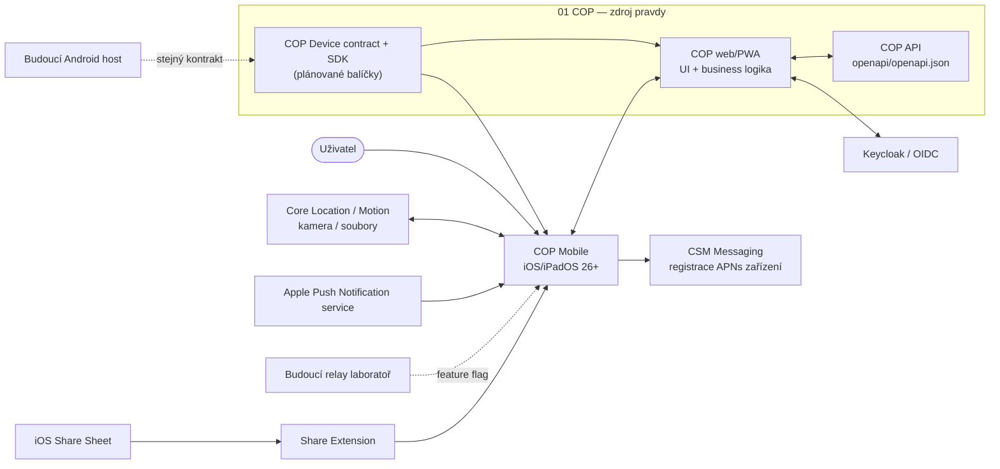

# Architecture

## Stav dokumentu

Tento dokument popisuje schválenou cílovou architekturu. Repozitář je ve fázi
2: obsahuje iOS feasibility host s bezpečným WebView baseline, bridge handshake
a read-only capability snapshotem. Senzory, tracking, push, Share Extension,
relay a Android zatím implementované nejsou.

První podporovanou platformou bude iOS/iPadOS 26.0. Android bude následovat nad
stejným kontraktem; nesmí kvůli němu vzniknout druhá webová nebo doménová
implementace.

## Účel a hranice produktu

COP Mobile je tenký nativní host existující aplikace COP. Uživatelům v terénu
zpřístupní stejné webové rozhraní mapy, chatu a hlášení jako browser/PWA a
doplní pouze funkce, které webová platforma neposkytuje dostatečně spolehlivě:

- přesnou polohu, kompas a 3D natočení zařízení;
- explicitně spuštěné sledování polohy na pozadí;
- fotografování, výběr a příjem fotografií a dokumentů;
- lokální a vzdálené notifikace a návrat na správnou webovou trasu;
- chráněné technické úložiště a diagnostiku;
- v pozdější laboratorní fázi device-to-device relay.

COP web zůstává jediným vlastníkem UI, mapy, chatu, doménových modelů,
autorizace a business workflow. COP Mobile není vlastníkem ani kopií těchto
částí.

### Mimo rozsah

- nativní mapa, chat, report formuláře, Matrix klient nebo AI orchestrace;
- nový mobilní backend či proxy COP API;
- garantované vyzvánění navzdory nastavení operačního systému;
- trvale běžící background mesh na iOS;
- produkční relay citlivých dat bez schváleného threat modelu, identity zařízení
  a end-to-end správy klíčů;
- Android implementace a plný lokální web bundle v první iOS etapě.

## Kontext systému

COP Mobile poskytuje nativní capability webu, ale neobchází COP API. Doménová
data jdou z webu přímo do existujících serverových kontraktů. Nativní host smí
zprostředkovat pouze technická data a operační služby zařízení.

## Architektonické principy

1. **Web je business source of truth.** Nativní vrstva neinterpretuje hlášení,
   incidenty, mapové vrstvy ani chatové zprávy.
2. **Contract authority je v 01 COP.** JSON Schema, TypeScript typy, webový
   `CopDevice` SDK a společné fixtures vzniknou v COP repozitáři. Mobilní
   repozitář spotřebuje připnutou verzi a validuje proti stejným fixtures.
3. **Capability-based chování.** Web se rozhoduje podle vyjednaných capabilities
   a omezení, nikoli podle user-agentu nebo názvu platformy.
4. **Nativní služba vlastní OS lifecycle.** WebView může požádat o operaci a
   číst stav, ale durable background tracking, share inbox a push lifecycle
   vlastní nativní proces.
5. **Bridge je nedůvěryhodná hranice.** Kontrola originu sama nestačí; každá
   zpráva má verzi, session, schema, limit, timeout a autorizaci metody.
6. **Velká data nejsou JSON bridge payload.** Fotografie a dokumenty se
   předávají opaque handlem `NativeAssetRef`, nikdy base64 nebo cestou k
   souboru.
7. **Pravdivé degraded stavy.** Aplikace rozlišuje online, cached offline a
   fresh-install fallback. Neprohlašuje read-only snapshot za zapisovatelný
   offline režim.

## Hlavní komponenty

| Komponenta | Odpovědnost | Nevlastní |
| --- | --- | --- |
| App shell | SwiftUI lifecycle, startup stav, deep link routing, globální fallback a diagnostika | COP navigaci a business UI |
| Web container | `WKWebView`, persistentní website data store, navigation policy a načtení COP HTTPS originu | doménová cache a autorizaci |
| Bridge coordinator | handshake, vyjednání verze, session, dispatch, timeout, cancel a event sequencing | schema authority |
| Origin policy a validator | přesný allowlist, main-frame kontrola, JSON Schema a limity | důvěru v obsah povolené stránky |
| Native services | `system`, `permissions`, `location`, `heading`, `attitude`, `tracking`, `connectivity`, `media`, `shares`, `notifications` | mapu, reporty, chat |
| Protected technical store | tracking samples, opaque asset metadata, share inbox a technické fronty s kvótami | webové tokeny a kopii COP databáze |
| Share Extension | import `NSItemProvider` položek do chráněného App Group inboxu | upload a report workflow |
| Relay adapter | pozdější foreground-oriented experiment s opaque obálkou | význam payloadu, vlastní kryptografický protokol |

Komponenty jsou cílové; ve fázi 0 nejsou implementovány.

## Datové toky

### Online start a bridge handshake

1. Host načte release konfiguraci a okamžitě zahájí navigaci na přesný COP HTTPS
   origin v persistentním `WKWebsiteDataStore`.
2. WebKit obslouží síťový nebo dříve cachovaný web shell. Bridge zůstává vypnutý
   během redirectů, pro iframe a na všech ostatních originech.
3. COP Device SDK odešle `bridge.hello` s podporovanými verzemi a ID web
   buildu.
4. Host zvolí kompatibilní verzi, vytvoří náhodný session ID a vrátí capabilities
   včetně omezení a velikostních limitů.
5. Teprve poté web volá povolené metody. Reload nebo změna main-frame originu
   zneplatní session a foreground subscriptions.

Podrobnosti jsou závazně popsány v ADR 0002 a `docs/api.md`.

### Senzory a durable tracking

Foreground `location`, `heading` a `attitude` subscriptions jsou vázané na
bridge session. `tracking.startSession` naproti tomu vytvoří nativně vlastněnou
session, která může v mezích iOS pokračovat po reloadu WebView. Web po novém
handshake získá stav přes `tracking.getSession` a čte vzorky stránkovaně přes
cursor. Uživatel vždy provede explicitní start/stop; background location není
náhradou za relay ani obecný background loop. 3D attitude je v první verzi
foreground-only.

### Sdílené soubory a média

Share Extension zkopíruje podporovanou položku do App Group inboxu, provede
základní typovou a velikostní validaci a skončí. Host po aktivaci publikuje
událost a web položku převezme přes `shares.list`/`shares.claim`. Kamera a
pickery používají stejný `NativeAssetRef`. Upload, oprávnění k reportu a
doménový lifecycle zůstávají ve webu a COP API.

### Autentizace a registrace push zařízení

OIDC relaci včetně refresh lifecycle vlastní COP web v odděleném WebKit origin
storage. Bridge se na login originu neaktivuje a nativní host webové access ani
refresh tokeny nečte.

APNs token neopouští nativní vrstvu směrem do JavaScriptu a COP jej neukládá.
Po doplnění kontraktu si autentizovaný web vyžádá v COP API krátkodobý,
jednorázový device-registration ticket, předá jej metodě bridge a host s ticketem
a APNs tokenem registruje zařízení přímo u CSM Messaging. Tato serverová změna
je blokující podmínkou pro remote push, ne pro lokální notifikace.

### Offline start

- Po alespoň jednom úspěšném online startu host znovu naviguje na stejný HTTPS
  origin a využije existující COP service worker, Cache Storage a IndexedDB.
- Pokud není k dispozici použitelný shell, zobrazí se lokálně zabalený SwiftUI
  fallback se stavem konektivity a opakováním; bridge ani doménové operace v něm
  nejsou dostupné.
- Současný COP offline snapshot je read-only. Offline vytvoření hlášení bude
  povoleno až po implementaci webového outboxu v 01 COP a contract testech.

ADR 0003 stanoví, proč první verze nebalí kopii celého web buildu.

### Push a deep link

CSM Messaging posílá minimální APNs payload. Host zpracuje kategorii a opaque
identifikátor, aktivuje aplikaci a předá bezpečně validovanou COP web route.
Citlivý obsah není součástí systémové notifikace bez explicitní serverové
politiky. Critical Alerts a CallKit nejsou součástí základního kontraktu:
Critical Alerts vyžadují Apple entitlement a CallKit smí reprezentovat pouze
skutečný VoIP hovor.

## Úložiště a vlastnictví dat

| Data | Úložiště | Vlastník a pravidla |
| --- | --- | --- |
| COP web cache, OIDC relace, offline snapshot, Matrix E2EE stav | persistentní WebKit origin storage | COP web; native obsah nečte ani nekopíruje |
| Capability/session stav bridge | paměť procesu | host; zneplatní se při reloadu/navigaci |
| Background tracking samples | chráněný native store | host; subject/session scope, omezená kvóta a retence |
| Share a media soubory | App Group / Application Support s Data Protection | host + extension; opaque ID, hash, kvóta, expirace |
| APNs device token | native technický store a CSM Messaging registry | nikdy COP API, webový JavaScript ani log |
| Relay queue | budoucí šifrovaný native store | pouze experiment; oddělená od webového business outboxu |
| Hlášení, chat, mapová data | COP/CSM/Matrix podle stávajících kontraktů | neukládají se jako paralelní nativní doménový model |

Konkrétní retenční a kvótové hodnoty musí být schváleny v security/privacy
milníku před implementací příslušné služby.

## Externí systémy a kontrakty

| Systém | Úloha | Autorita kontraktu |
| --- | --- | --- |
| COP web/PWA | veškeré produktové UI a business workflow | repozitář `01 COP` |
| COP API | doménová data, pairing, device audit, snapshot, attachments, mesh gateway | `01 COP/openapi/openapi.json` |
| Keycloak | OIDC pro webovou relaci | konfigurace a runbooky `01 COP` |
| CSM Messaging | APNs registry, doručení push, Matrix bootstrap | kontrakt služby CSM Messaging |
| APNs | systémové doručení notifikací | Apple capability/provisioning |
| iOS Share Sheet | příjem fotek a dokumentů | App Extension kontrakt |
| Budoucí Android host | parita Device API | stejná JSON Schema z `01 COP` |

COP Mobile neposkytuje vlastní REST API. Detail spotřebovávaných a plánovaných
kontraktů je v `docs/api.md`.

## Autentizace a autorizace

- Web používá stávající OIDC/Keycloak flow a bearer tokeny vůči COP API.
- Nativní host neimplementuje druhý login, nevlastní webový refresh token a
  nevkládá vlastní authorization rozhodnutí do doménových workflow.
- Každá bridge metoda kontroluje session, capability, aktuální permission,
  foreground/background stav a případný serverový kill switch.
- Release bridge je dostupný pouze přes přesnou kombinaci scheme, host a port;
  production baseline je `https://cop.zeleznalady.cz`. Login a další povolené
  navigační originy nikdy nezískají Device API.
- Externí odkazy se otevírají mimo interní WebView. Wildcard origin a bridge v
  iframe jsou zakázané.

## Distribuce a prostředí

- Samostatný repozitář umožní nezávislý signing a App Store release bez
  přesouvání COP monorepa.
- První target je univerzální iPhone/iPad aplikace s minimem iOS/iPadOS 26.0,
  Swift 6 a stabilním Xcode/SDK. iOS 27 preview API nesmí být produkční
  závislostí.
- První distribuce je interní/TestFlight pilot. Veřejný App Store nebo MDM
  rollout následuje až po permission, privacy, battery a real-device validaci.
- Release používá pouze production originy; staging a debug mají separátní,
  explicitní allowlisty. Debug výjimky nesmějí být zkompilovány do release.
- Web může být nasazován nezávisle pouze v rámci kompatibilní major verze Device
  API. Nekompatibilní web build musí zobrazit řízený stav `BLOCKED`, nikoli
  volat neznámé native metody.

## Omezení platformy

iOS může background práci pozastavit nebo proces ukončit. Host proto garantuje
trvalost stavu explicitní tracking session, nikoli nepřetržité vzorkování,
zvonění nebo relay. Time Sensitive notifikaci může uživatel umlčet. Critical
Alert je samostatně schvalovaná capability. Device-to-device relay zůstane
defaultně vypnutou foreground laboratoří, dokud neprojde iOS–Android fyzický,
bezpečnostní a privacy gate.
