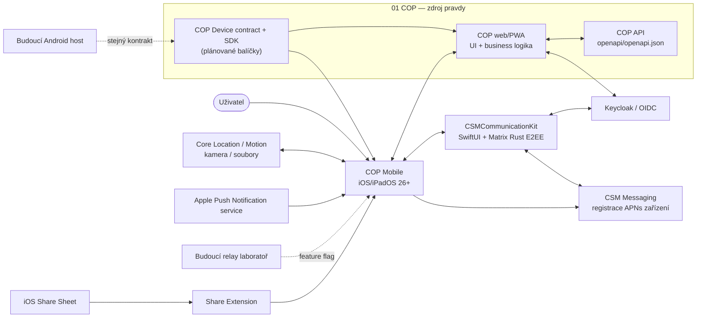

# Architecture

## Stav dokumentu

Tento dokument popisuje schválenou cílovou architekturu po ADR 0009. Repozitář
obsahuje hybridní iOS host: bezpečný COP WebView a Device bridge, nativní E2EE
chat přes `CSMCommunicationKit` a nativní prezentaci skutečných VoIP hovorů.
Plně nativní WebRTC, další senzory, tracking, Share Extension, relay a Android
mají vlastní implementační a akceptační gates.

První podporovanou platformou bude iOS/iPadOS 26.0. Android bude následovat nad
stejným kontraktem; nesmí kvůli němu vzniknout druhá webová nebo doménová
implementace.

## Účel a hranice produktu

COP Mobile je hybridní host existující aplikace COP. Uživatelům v terénu
zpřístupní stejné webové rozhraní mapy a hlášení jako browser/PWA, nativní E2EE
komunikační povrch a funkce, které webová platforma neposkytuje dostatečně
spolehlivě:

- přesnou polohu, kompas a 3D natočení zařízení;
- explicitně spuštěné sledování polohy na pozadí;
- fotografování, výběr a příjem fotografií a dokumentů;
- lokální a vzdálené notifikace a návrat na správnou webovou trasu;
- nativní chat, offline timeline/outbox a Matrix E2EE lifecycle;
- systémovou prezentaci hovoru, CallKit, audio routing a proximity blackout;
- chráněné technické úložiště a diagnostiku;
- v pozdější laboratorní fázi device-to-device relay.

COP web zůstává jediným vlastníkem mapy, hlášení, vrstev, doménových modelů,
autorizace a ostatních business workflow. Nativní komunikaci vlastní
`CSMCommunicationKit`; host ani bridge neinterpretují Matrix credentials nebo
decrypted chat payload.

### Mimo rozsah

- nativní mapa, report formuláře nebo AI orchestrace;
- nový mobilní backend či proxy COP API;
- plně nativní WebRTC/media engine před samostatným ADR a interoperability gate;
- garantované vyzvánění navzdory nastavení operačního systému;
- trvale běžící background mesh na iOS;
- produkční relay citlivých dat bez schváleného threat modelu, identity zařízení
  a end-to-end správy klíčů;
- Android implementace a plný lokální web bundle v první iOS etapě.

## Kontext systému

COP Mobile poskytuje nativní capability webu, ale neobchází COP API. Doménová
data mapy a hlášení jdou z webu přímo do existujících serverových kontraktů.
Komunikační modul volá COP, CSM Messaging a Matrix pouze přes jejich existující
autentizované kontrakty a vlastní svůj oddělený nativní OIDC/Matrix lifecycle.

## Architektonické principy

1. **Web je business source of truth.** Nativní vrstva neinterpretuje hlášení,
   incidenty ani mapové vrstvy. Komunikační zprávy interpretuje pouze uzavřený
   `CSMCommunicationKit` podle Matrix/CSM kontraktů.
2. **Contract authority je v 01 COP.** JSON Schema, TypeScript typy, webový
   `CopDevice` SDK a společné fixtures vzniknou v COP repozitáři. Mobilní
   repozitář spotřebuje připnutou verzi a validuje proti stejným fixtures.
3. **Capability-based chování.** Web se rozhoduje podle vyjednaných capabilities
   a omezení, nikoli podle user-agentu nebo názvu platformy.
4. **Nativní služba vlastní OS lifecycle.** WebView může požádat o operaci a
   číst stav, ale durable background tracking, share inbox a push lifecycle
   vlastní nativní proces.
5. **Bridge je nedůvěryhodná hranice.** Kontrola originu sama nestačí; každá
   zpráva má verzi, session, schema, limit, timeout a autorizaci metody.
6. **Velká data nejsou JSON bridge payload.** Fotografie a dokumenty se
   předávají opaque handlem `NativeAssetRef`, nikdy base64 nebo cestou k
   souboru.
7. **Pravdivé degraded stavy.** Aplikace rozlišuje online, cached offline a
   fresh-install fallback. Neprohlašuje read-only snapshot za zapisovatelný
   offline režim.
8. **Oddělené identity a secrets.** Webová a nativní OIDC/Matrix session jsou
   samostatné; žádný token, recovery material, decrypted event, SDP ani ICE
   candidate nepřechází Device bridgem.
9. **Staged call ownership.** Native vlastní CallKit, SwiftUI prezentaci,
   proximity a audio routing. Dokud neprojde native-WebRTC gate, web vlastní
   Matrix call signalizaci a WebRTC média.
10. **Bounded group calls.** Nativní chat může spustit a aktivní call view
    rozšířit Matrix skupinový hovor, ale přes bridge teče jen bounded participant
    metadata a opaque action. Web vlastní encrypted peer mesh s limitem šesti
    účastníků a server je autoritou pro členství cílových identit.

## Hlavní komponenty

| Komponenta | Odpovědnost | Nevlastní |
| --- | --- | --- |
| App shell | SwiftUI lifecycle, volbu COP/chat povrchu, deep link routing, call overlay, globální fallback a diagnostika | mapovou a report business logiku |
| Web container | `WKWebView`, persistentní website data store, navigation policy a načtení COP HTTPS originu | doménová cache a autorizaci |
| `CSMCommunicationKit` | nativní SwiftUI chat, OIDC/PKCE, Keychain, Matrix Rust E2EE, timeline a offline outbox | mapu, hlášení a COP business workflow |
| Native call presentation | CallKit/PushKit, SwiftUI call view, `AVAudioSession`, mute/route a proximity | přechodnou Matrix signalizaci, SDP/ICE a WebRTC média |
| Bridge coordinator | handshake, vyjednání verze, session, dispatch, timeout, cancel a event sequencing | schema authority |
| Origin policy a validator | přesný allowlist, main-frame kontrola, JSON Schema a limity | důvěru v obsah povolené stránky |
| Native services | `system`, `permissions`, `location`, `heading`, `attitude`, `tracking`, `connectivity`, `media`, `shares`, `notifications` | mapu a reporty |
| Protected stores | nativní OIDC/Matrix credentials, Matrix crypto/timeline/outbox, tracking, asset a share data podle oddělených policies | webové cookies nebo kopii COP mapové databáze |
| Share Extension | import `NSItemProvider` položek do chráněného App Group inboxu | upload a report workflow |
| Relay adapter | pozdější foreground-oriented experiment s opaque obálkou | význam payloadu, vlastní kryptografický protokol |

Komponenty jsou cílové; ve fázi 0 nejsou implementovány.

## Datové toky

### Online start a bridge handshake

1. Host načte release konfiguraci a okamžitě zahájí navigaci na přesný COP HTTPS
   origin v persistentním `WKWebsiteDataStore`.
2. WebKit obslouží síťový nebo dříve cachovaný web shell. Bridge zůstává vypnutý
   během redirectů, pro iframe a na všech ostatních originech.
3. COP Device SDK odešle `bridge.hello` s podporovanými verzemi a ID web
   buildu.
4. Host zvolí kompatibilní verzi, vytvoří náhodný session ID a vrátí capabilities
   včetně omezení a velikostních limitů.
5. Teprve poté web volá povolené metody. Reload nebo změna main-frame originu
   zneplatní session a foreground subscriptions.

Podrobnosti jsou závazně popsány v ADR 0002 a `docs/api.md`.

### Senzory a durable tracking

Foreground `location`, `heading` a `attitude` subscriptions jsou vázané na
bridge session. `tracking.startSession` naproti tomu vytvoří nativně vlastněnou
session, která může v mezích iOS pokračovat po reloadu WebView. Web po novém
handshake získá stav přes `tracking.getSession` a čte vzorky stránkovaně přes
cursor. Uživatel vždy provede explicitní start/stop; background location není
náhradou za relay ani obecný background loop. 3D attitude je v první verzi
foreground-only.

### Sdílené soubory a média

Share Extension zkopíruje podporovanou položku do App Group inboxu, provede
základní typovou a velikostní validaci a skončí. Host po aktivaci publikuje
událost a web položku převezme přes `shares.list`/`shares.claim`. Kamera a
pickery používají stejný `NativeAssetRef`. Upload, oprávnění k reportu a
doménový lifecycle zůstávají ve webu a COP API.

### Autentizace, nativní komunikace a registrace push zařízení

COP web vlastní svou OIDC relaci v odděleném WebKit origin storage.
`CSMCommunicationKit` vlastní druhou, nativní Authorization Code + PKCE relaci
pro veřejný klient `csm-mobile`, ukládá ji do Keychainu a používá ji k získání
COP/CSM Matrix bootstrapu. Session se nesdílejí a native nikdy nečte WebKit
storage. Logout/revokace a změna subjectu čistí příslušná nativní credentials a
subject-bound stores bez zpřístupnění dat předchozího uživatele.

COP Mobile má přesto jen jedno viditelné místo pro přihlášení: mapu. Při
otevření chatu komunikační modul nejprve tiše obnoví svou nativní Keychain
session; přechodný stav nezobrazuje login. Pokud session chybí, chat pouze
vyzve k návratu a přihlášení v mapě. Toto UI pravidlo nekopíruje WebKit bearer
token do nativního Keychainu a nemění oddělené OIDC klienty.

Host předává komunikačnímu povrchu skutečný horní safe-area inset. Seznam jej
použije jako kořenové odsazení, zatímco otevřená konverzace jej započítá uvnitř
pevné hlavičky. Hlavička proto zůstává pod status barem/Dynamic Island jako
jedna plovoucí zaoblená Liquid Glass karta i při otevřené klávesnici.
Přímý chat zobrazuje avatar protějšku nebo jeho iniciály; skupina používá jen
vlastní Matrix room avatar nebo iniciály názvu. V detailu skupiny lze tento
avatar samostatně vybrat, změnit nebo odstranit.

APNs token neopouští nativní vrstvu směrem do JavaScriptu a COP jej neukládá.
COP Mobile je jediným vlastníkem process-wide notification delegate; běžný
token, foreground/background delivery a notification actions současně předává
přes úzkou facade do `CSMCommunicationKit`, aby nativní Matrix pusher a deep
link neztrácely lifecycle ani cílovou konverzaci.
Před dokončením foreground, background nebo notification-action callbacku host
awaituje headless zpracování facade. Sdílený runtime se tak spustí a zpracuje
způsobilé metadata-only payloady i bez připojeného SwiftUI chat view.
Metadata-only push přijatý před připravenou nativní session zůstane v omezené
paměťové frontě komunikačního runtime; po dokončení přihlášení a bootstrapu se
atomicky claimne. Stejný payload se proto nezpracuje dvakrát ani nezmizí při
cold startu.
Po doplnění kontraktu si autentizovaný web vyžádá v COP API krátkodobý,
jednorázový device-registration ticket, předá jej metodě bridge a host s ticketem
a APNs tokenem registruje zařízení přímo u CSM Messaging. Tato serverová změna
je blokující podmínkou pro remote push, ne pro lokální notifikace.

Web může otevřít nativní komunikační povrch metodou
`communications.openChat`; payload je prázdný. Modul hostu nevrací token,
timeline ani Matrix interní stav.

### Offline start

- Po alespoň jednom úspěšném online startu host znovu naviguje na stejný HTTPS
  origin a využije existující COP service worker, Cache Storage a IndexedDB.
- Pokud není k dispozici použitelný shell, zobrazí se lokálně zabalený SwiftUI
  fallback se stavem konektivity a opakováním; bridge ani doménové operace v něm
  nejsou dostupné.
- Současný COP offline snapshot je read-only. Offline vytvoření hlášení bude
  povoleno až po implementaci webového outboxu v 01 COP a contract testech.

ADR 0003 stanoví, proč první verze nebalí kopii celého web buildu.

### Push a deep link

CSM Messaging posílá minimální APNs payload. Host zpracuje kategorii a opaque
identifikátor a podle typu otevře autorizovaný nativní chat nebo validovanou COP
web route.
Citlivý obsah není součástí systémové notifikace bez explicitní serverové
politiky. Critical Alerts vyžadují Apple entitlement. Podle ADR 0009 PushKit
probudí host, CallKit a SwiftUI převezmou systémovou prezentaci a proximity;
Matrix `matrix-js-sdk` ve WebView přechodně vlastní signalizaci a WebRTC média.
Bridge zrcadlí pouze bounded presentation state, nikdy SDP/ICE nebo credentials.
U skupinového hovoru obsahuje presentation pouze typ hovoru a jméno/user ID/
connected flag členů. `start` a `addParticipants` se vracejí jako spolehlivé
opaque akce; cílové členství ověřuje web a COP API, nikoli SwiftUI seznam.
Call action vzniklá před bridge handshake se drží v omezené paměťové frontě;
každý povel má stabilní `actionId`, native jej do bounded timeoutu opakuje a
CallKit action splní až po Matrix ACK vedeném zpět přes chat, host a Device
bridge. Chat drží povel do vzniku odpovídajícího Matrix call snapshotu; retry se
stejným `actionId` znovu nespustí Matrix operaci, pouze zopakuje uložené ACK.
Chyba při předání eventu do JavaScriptu invaliduje bridge session a vrátí event
do bounded fronty. Zánik webového procesu nebo aktivní bridge session ukončí
webem vlastněnou call presentation jako failed, aby nezůstal ghost CallKit
hovor. PushKit call, který ještě čeká na připojení webového media enginu, zůstává
od této invalidace oddělený. Reset `CXProvider` navíc vyšle spolehlivý hangup pro
každý webem vlastněný media call; callback `CXStartCallAction` nesmí vrátit již
connected hovor zpět do connecting.
Záporný ACK nebo timeout vyvolá process-wide invalidaci webových médií přes
`AppModel`, reload WebView, report/remove CallKit call a deaktivaci audio session.
Tím může `end`/`reject` skončit jako splněný až po prokazatelném forced close;
`answer`/`mute` zůstává fail-closed. Stejná větev se spouští z CallKit
`timedOutPerforming`, protože běžný retry `Task` nemusí při suspendovaném procesu
běžet.

## Úložiště a vlastnictví dat

| Data | Úložiště | Vlastník a pravidla |
| --- | --- | --- |
| COP web cache, webová OIDC relace a offline snapshot | persistentní WebKit origin storage | COP web; native obsah nečte ani nekopíruje |
| Nativní OIDC/Matrix credentials a store passphrase | Keychain s device-only accessibility | `CSMCommunicationKit`; nikdy bridge, log ani diagnostický export |
| Nativní Matrix crypto, timeline a communication outbox | chráněný Matrix/application store | `CSMCommunicationKit`; subject/device scope, E2EE a bezpečný cleanup |
| Capability/session stav bridge | paměť procesu | host; zneplatní se při reloadu/navigaci |
| Background tracking samples | chráněný native store | host; subject/session scope, omezená kvóta a retence |
| Share a media soubory | App Group / Application Support s Data Protection | host + extension; opaque ID, hash, kvóta, expirace |
| APNs device token | native technický store a CSM Messaging registry | nikdy COP API, webový JavaScript ani log |
| Relay queue | budoucí šifrovaný native store | pouze experiment; oddělená od webového business outboxu |
| Hlášení a mapová data | COP podle stávajících kontraktů | nevzniká paralelní nativní business model |

Podepisovaný APNs entitlement používá `$(APS_ENVIRONMENT)`: Debug žádá
`development`, Staging a Release `production`. Každý artifact musí být spárován
se stejným APNs prostředím v CSM Messaging: Debug se sandboxem, Staging/Release
s production endpointem. Současný registrační kontrakt prostředí neukládá na
úrovni zařízení a server obsluhuje vždy jen jedno globální prostředí; Debug a
TestFlight tokeny proto nelze bezpečně míchat. Před TestFlight je povinný řízený
cutover na production, nebo samostatně navržený per-device environment kontrakt.

Konkrétní retenční a kvótové hodnoty musí být schváleny v security/privacy
milníku před implementací příslušné služby.

## Externí systémy a kontrakty

| Systém | Úloha | Autorita kontraktu |
| --- | --- | --- |
| COP web/PWA | mapa, hlášení, vrstvy a business workflow; přechodný Matrix/WebRTC call engine | repozitář `01 COP` |
| COP API | doménová data, pairing, device audit, snapshot, attachments, mesh gateway | `01 COP/openapi/openapi.json` |
| `CSMCommunicationKit` | nativní chat UI, OIDC/Keychain, Matrix Rust E2EE, offline communication state a metadata-only voice-call launch callback | GitHub Swift Package `voldzi/CSM-messenger`, exact revision `ea42316f806f1172d801e8c355c462ba12324814` + ADR 0009 |
| Keycloak | oddělené OIDC relace pro web a veřejný nativní PKCE klient | konfigurace a runbooky `01 COP` |
| CSM Messaging / Matrix | APNs registry, push, conversation metadata, Matrix bootstrap a E2EE transport | kontrakt služby CSM Messaging/Matrix |
| APNs | systémové doručení notifikací | Apple capability/provisioning |
| iOS Share Sheet | příjem fotek a dokumentů | App Extension kontrakt |
| Budoucí Android host | parita Device API | stejná JSON Schema z `01 COP` |

COP Mobile neposkytuje vlastní REST API. Detail spotřebovávaných a plánovaných
kontraktů je v `docs/api.md`.

## Autentizace a autorizace

- Web používá stávající OIDC/Keycloak flow a bearer tokeny vůči COP API.
- `CSMCommunicationKit` používá samostatný veřejný OIDC/PKCE klient a vlastní
  nativní access/refresh lifecycle v Keychainu. Nikdy nepřebírá webový token a
  nevkládá vlastní authorization rozhodnutí do mapových/report workflow.
- Každá bridge metoda kontroluje session, capability, aktuální permission,
  foreground/background stav a případný serverový kill switch.
- Release bridge je dostupný pouze přes přesnou kombinaci scheme, host a port;
  production baseline je `https://cop.zeleznalady.cz`. Login a další povolené
  navigační originy nikdy nezískají Device API.
- Externí odkazy se otevírají mimo interní WebView. Wildcard origin a bridge v
  iframe jsou zakázané.
- `communications.openChat` pouze prezentuje nativní povrch;
  `calls.updatePresentation` přijme omezený enum stavu a bounded opaque ID.
  Žádná metoda nevystavuje nativní OIDC/Matrix credentials, zprávy, SDP nebo
  ICE kandidáty.
- WebKit media capture je oddělený od Device API bridge: audio-only požadavek
  smí přijít také ze same-origin COP Chat iframe, ale pouze pokud frame i hlavní
  dokument odpovídají přesnému release COP originu. Cross-origin iframe, video
  a kombinované camera+microphone požadavky zůstávají zamítnuté.
  Výchozí port, který `WKSecurityOrigin` hlásí jako `0`, se před porovnáním
  normalizuje na `443` pro HTTPS nebo `80` pro HTTP.

## Distribuce a prostředí

- Samostatný repozitář umožní nezávislý signing a App Store release bez
  přesouvání COP monorepa.
- První target je univerzální iPhone/iPad aplikace s minimem iOS/iPadOS 26.0,
  Swift 6 a stabilním Xcode/SDK. iOS 27 preview API nesmí být produkční
  závislostí.
- První distribuce je interní/TestFlight pilot. Veřejný App Store nebo MDM
  rollout následuje až po permission, privacy, battery a real-device validaci.
- Release používá pouze production originy; staging a debug mají separátní,
  explicitní allowlisty. Debug výjimky nesmějí být zkompilovány do release.
- Web může být nasazován nezávisle pouze v rámci kompatibilní major verze Device
  API. Nekompatibilní web build musí zobrazit řízený stav `BLOCKED`, nikoli
  volat neznámé native metody.

## Omezení platformy

iOS může background práci pozastavit nebo proces ukončit. Host proto garantuje
trvalost stavu explicitní tracking session, nikoli nepřetržité vzorkování,
zvonění nebo relay. Time Sensitive notifikaci může uživatel umlčet. Critical
Alert je samostatně schvalovaná capability. Device-to-device relay zůstane
defaultně vypnutou foreground laboratoří, dokud neprojde iOS–Android fyzický,
bezpečnostní a privacy gate.
